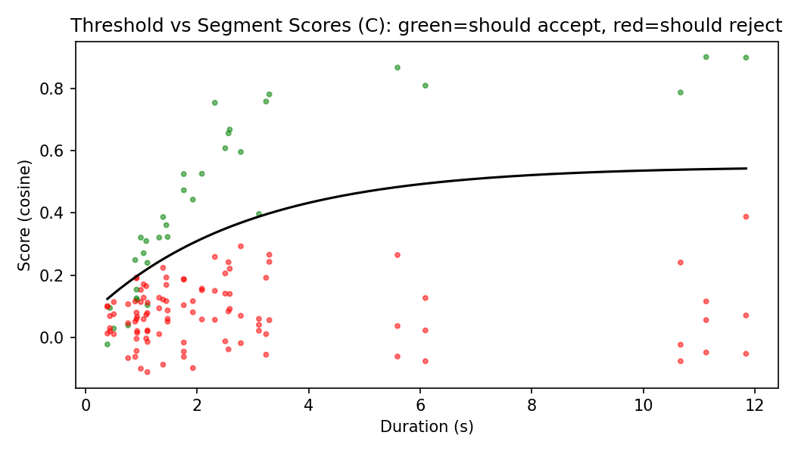
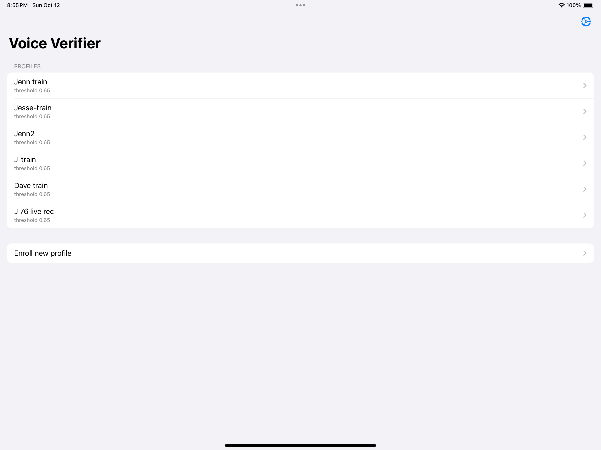
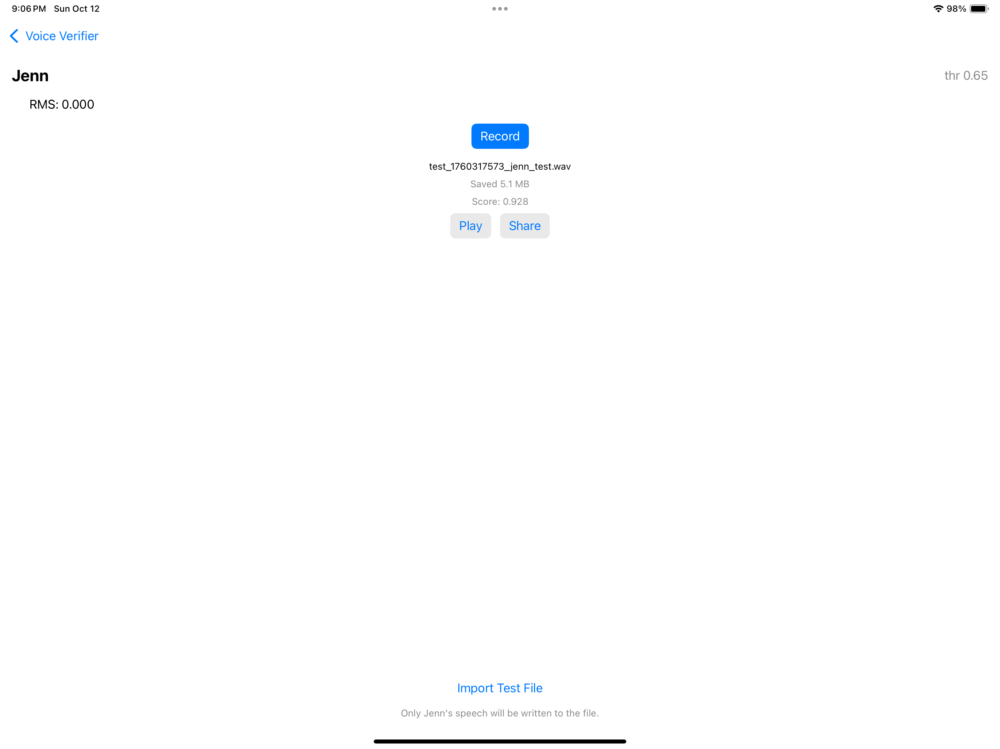
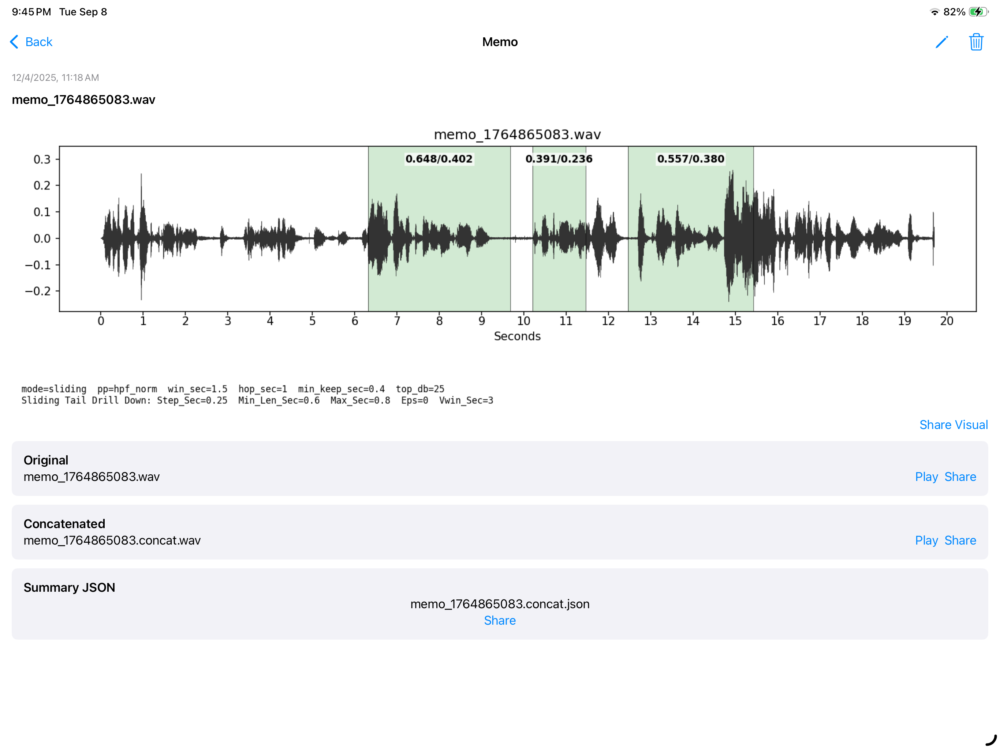

# Voice Verifier

**On-device speaker verification for iOS.** Enroll a speaker once, then point the app at any recording and it keeps only *that* person's speech — segment by segment — using [SpeechBrain](https://speechbrain.github.io/) ECAPA-TDNN embeddings and a duration-aware decision threshold.

> Self-directed project built for credit in the Ferris State University AI program (~10 weeks, documented weekly). iOS (Swift) client + Python (FastAPI) inference server.

### 🎧 One-minute walkthrough

<video src="https://github.com/Jesse-Anders/voice-verifier/raw/main/images/voice-verifier-brief-walkthrough.mp4" controls muted width="620"></video>

▶ **[Watch the one-minute walkthrough](images/voice-verifier-brief-walkthrough.mp4)** — a quick tour of the basic app flow: enroll a speaker, run a recording through, and see which speech is kept. *(Click the link if the inline player doesn't load in your browser.)*

---

## What it does

Given a short **enrollment** recording of a target speaker, Voice Verifier builds a reference voiceprint. You can then hand it a longer **test** recording that may contain multiple people, and it will:

1. Split the audio into speech segments.
2. Score each segment against the enrolled voiceprint.
3. Accept or reject each segment using a threshold that adapts to segment length.
4. Write out a new WAV containing **only the enrolled speaker's accepted segments**, plus a JSON summary of every decision.

In the demo above, a test clip scores **0.928** cosine similarity against the enrolled "Jenn" profile and is accepted (threshold 0.65).

## Why it's built this way

A naïve verifier uses one global cosine threshold for every clip. In practice, **short segments produce noisy embeddings** — a 0.4-second slice simply carries less speaker evidence than a 4-second one — so a single fixed threshold either lets false accepts through on short clips or rejects good long ones.

The fix is a **duration-aware threshold**: the accept bar starts low for very short segments and rises with duration before plateauing. The chart below plots real segment scores (green = should accept, red = should reject) against the fitted threshold curve.

<p align="center">
  
</p>

## Architecture

The heavy ML runs on the server; the privacy-sensitive audio slicing and the accept/reject decision run **on the device**.

```
┌─────────────────────────────┐         ┌──────────────────────────────────────┐
│  iOS app (Swift)            │  HTTP   │  FastAPI server (embed_server.py)      │
│                             │ ──────► │                                        │
│  • Enroll / record          │         │  SpeechBrain ECAPA-TDNN                │
│  • Slice segments → WAV     │         │  (EncoderClassifier)                   │
│  • Cosine similarity        │ ◄────── │                                        │
│  • Duration-aware threshold │  embed  │  /segments      amplitude VAD          │
│  • Concatenate accepted WAV │  vectors│  /segments_scd  ECAPA speaker-change   │
│  • JSON decision summary    │         │  /embed_mean    embedding for a WAV    │
└─────────────────────────────┘         └──────────────────────────────────────┘
```

**Server (Python / FastAPI)** hosts the SpeechBrain ECAPA-TDNN model and does all embedding work:

| Endpoint | Purpose |
| --- | --- |
| `/embed_mean` | Returns a mean embedding vector for a WAV. Optional `pp` query controls preprocessing (e.g. `hpf_norm`, `lufs_hpf`). |
| `/segments` | Amplitude-based voice-activity segmentation via `librosa.effects.split` (no model). |
| `/segments_scd` | ECAPA-based speaker-change detection — windows the audio, embeds each window, and detects speaker boundaries. |
| `/score_cosine` | Optional server-side scoring (not used by the app today; kept for experiments). |

**iOS app (Swift)** chooses the segmentation mode, slices accepted spans to temporary WAVs on-device, computes cosine similarity against the enrolled embedding **locally**, applies the duration-aware threshold **locally**, and writes the accepted-only WAV + JSON summary.

> A minimal on-device Torch verifier (`SpeakerVerifier`) also exists but is bypassed by default (`SkipLocalModel`) — kept for offline experiments and optional retraining. Normal flow uses server embeddings.

## Key engineering decisions

- **Client/server split by concern, not convenience** — the ~20M-parameter embedding model lives on the server; segment slicing, similarity, and the final accept/reject decision stay on-device (lower round-trips, decision logic auditable client-side).
- **Two segmentation strategies with an explicit trade-off** — fast amplitude VAD vs. slower, more accurate ECAPA speaker-change detection, switchable in Settings.
- **Duration-aware thresholding** instead of a single global cutoff, fit from labeled accept/reject segments.
- **Tunable front-end preprocessing** (`hpf_norm`, `lufs_hpf`) so the same model can be evaluated under different loudness/high-pass conditions.

## App flow

| Profiles | Test result |
| --- | --- |
|  |  |

**Recording analysis view** — after a recording is processed, each region is marked with its verdict: **green = accepted** (matched the enrolled speaker), **white = rejected**. Only the green regions are written to the output WAV.

<p align="center">
  
</p>

## Tech stack

- **iOS:** Swift / SwiftUI, AVFoundation (recording), on-device WAV slicing & concatenation
- **Server:** Python, FastAPI, Uvicorn, SpeechBrain (ECAPA-TDNN `EncoderClassifier`), librosa, PyTorch
- **Signal path:** ECAPA speaker embeddings → cosine similarity → duration-aware threshold

## Running it locally

**1. Start the inference server**

```bash
# from the repo root (Python 3.11+)
pip install -r server/requirements.txt
python -m uvicorn server.embed_server:app --host 0.0.0.0 --port 8000
```

The server downloads the SpeechBrain ECAPA model from the Hub on first run — no
model file needs to be committed.

**2. Point the app at the server**

In the iOS app, open **Settings → Server Base URL** and enter your machine's address (e.g. `http://<your-lan-ip>:8000`).

**3. Enroll and test**

Enroll a speaker profile, then **Record** or **Import Test File** to score a clip and generate the accepted-only WAV.

**Building the iOS app**

- Xcode 16+ (Swift 5; iOS 18.2 deployment target, Podfile minimum iOS 15).
- Install the pods (LibTorch) and open the workspace, not the project:

  ```bash
  cd ios && pod install && open VoiceVerifier.xcworkspace
  ```

- Select the **VoiceVerifier** scheme, set your team under **Signing & Capabilities**, and run on a device or simulator.
- The default flow embeds audio via the server, so **no bundled model is required**. The optional on-device verifier (`SpeakerVerifier`, off by default via `SkipLocalModel`) needs a TorchScript model — generate it with `python server/export_torchscript.py --out ecapa_embedding.pt` and add it to the app's `Model` group.

## Repository layout

```
voice-verifier/
  README.md
  LICENSE
  .gitignore
  SCRUB_CHECK.md
  images/                         screenshots, the threshold chart, and the walkthrough .mp4
  server/                         FastAPI inference server
    embed_server.py               ECAPA embedding + segmentation endpoints
    export_torchscript.py         exports the on-device TorchScript model
    requirements.txt              pinned dependencies
  ios/                            Xcode workspace (CocoaPods / LibTorch)
    Podfile · Podfile.lock
    VoiceVerifier.xcworkspace/
    VoiceVerifier/
      VoiceVerifier.xcodeproj/
      VoiceVerifier/              app target (SwiftUI)
        App/                      VoiceVerifierApp, ContentView, RecordingView, EnrollmentView, SettingsView, MemoDetailView
        ML/                       EmbedAPI, SegmentsAPI, PlotAPI, ModelProvider, SpeakerVerifier, TorchModule.{h,mm}
        Audio/                    AudioEngine.swift
        Storage/                  ProfileStore, MemoStore
        Model/                    (TorchScript model goes here — not committed)
      VoiceVerifier2/             second experimental target
      VoiceVerifierTests/ · VoiceVerifierUITests/
```

Key modules: `RecordingView` builds the concatenated accepted-only WAV via
`SegmentsAPI` + `EmbedAPI`; `SettingsView` selects the segmentation mode and
server URL; `SpeakerVerifier` is the optional on-device Torch path (bypassed by
default).

## Status & scope

Working prototype from a for-credit independent study; not a production/shipping app. Built, evaluated, and documented solo over ~10 weeks.

---

*Built by Jesse Anders.*
